# Wholesale ERP System (বারাকাহ ক্লথ স্টোর)

A comprehensive Wholesale Enterprise Resource Planning system built with Next.js App Router, Prisma, and TailwindCSS, designed specifically for rapid and secure data entry with complete localization in Bengali.

## Key Features
- **Dashboard Overview**: Detailed statistics for sales, purchases, and low-stock items.
- **Inventory Management**: Track products accurately.
- **Customers & Suppliers Ledgers**: Track balances, transactions, and payments.
- **Sales & Purchases**: Dynamic invoice creation and ledger tracking.
- **Returns & Expenses**: Log incoming defective items and outgoing business expenses.
- **Reports**: Generate daily, monthly, and yearly business overview reports.
- **Localization**: Full support for Bengali language & number formatting.

---

## System Screenshots

Here is a full breakdown of the application interfaces:

### 1. 📊 Dashboard
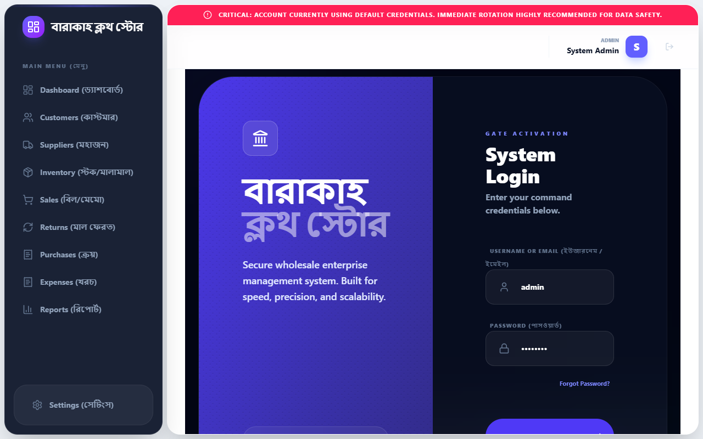

### 2. 👥 Customers (কাস্টমার)
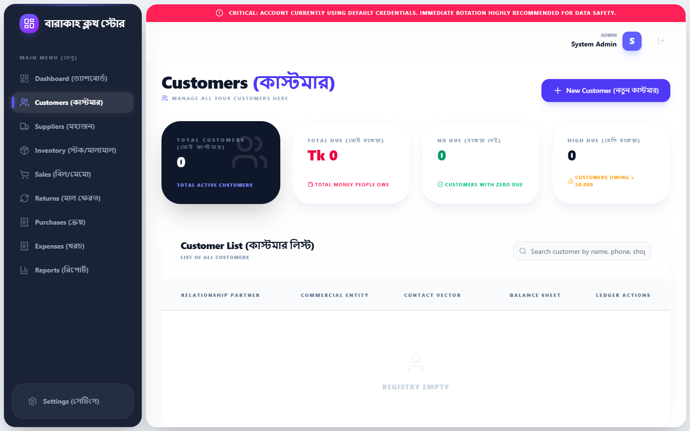

### 3. 🏢 Suppliers (মহাজন)
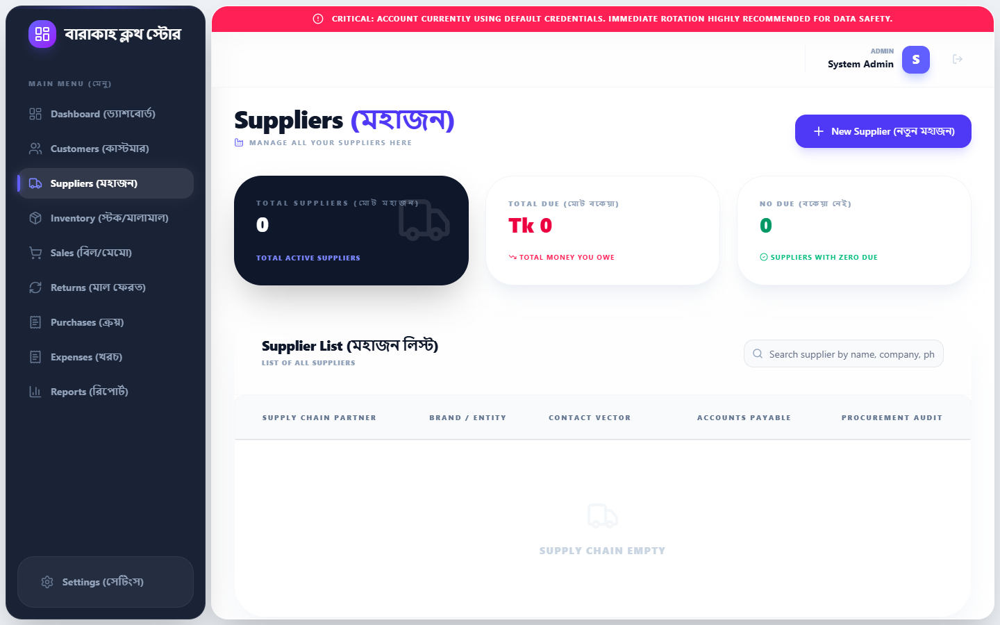

### 4. 📦 Inventory (স্টক/মালামাল)

### 5. 🛒 Sales (বিল/মেমো)
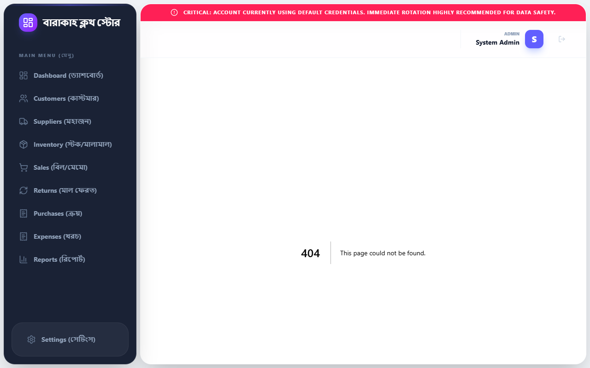

### 6. 🔄 Returns (মাল ফেরত)
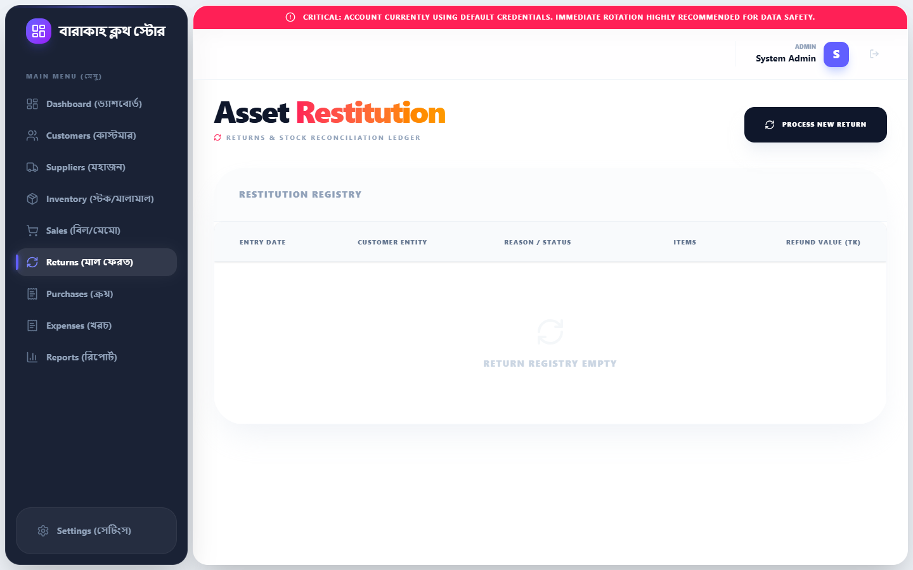

### 7. 📥 Purchases (ক্রয়)
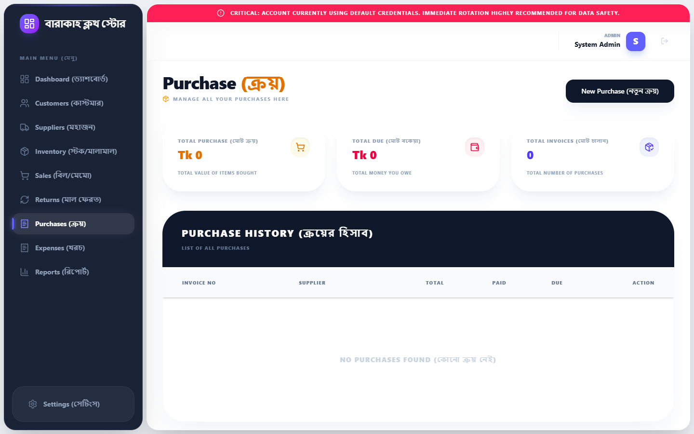

### 8. 💸 Expenses (খরচ)
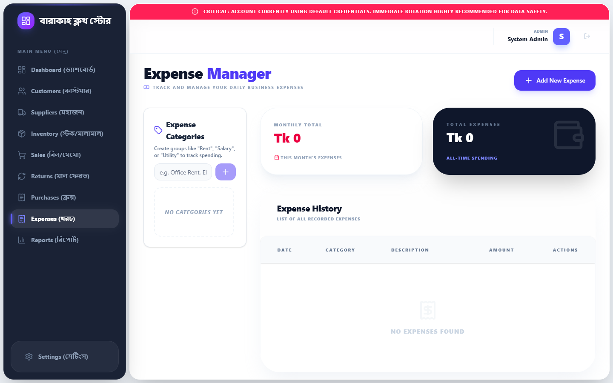

### 9. 📈 Reports (রিপোর্ট)
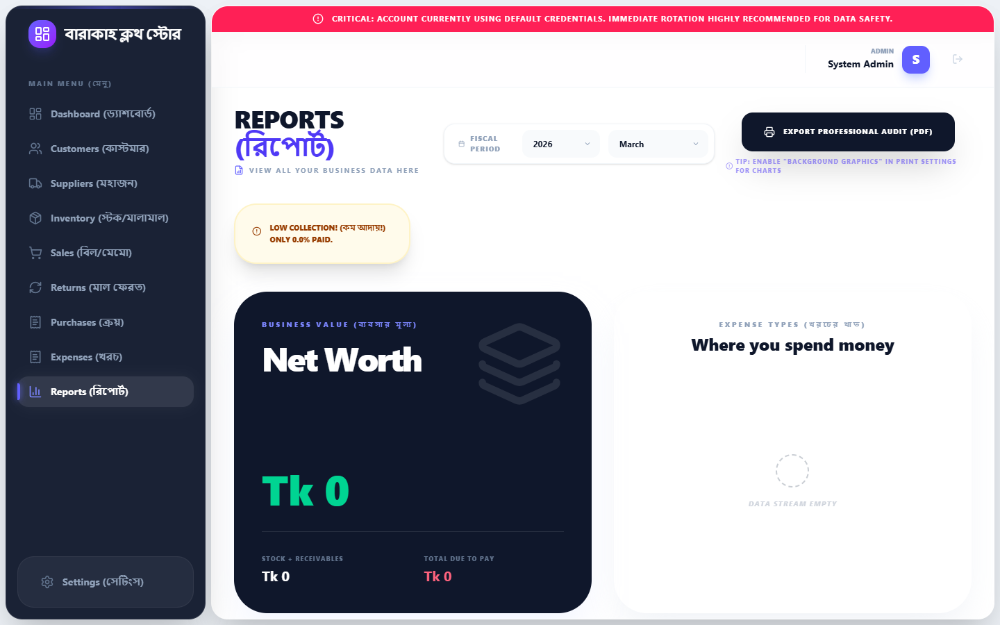

### 10. ⚙️ Settings (সেটিংস)
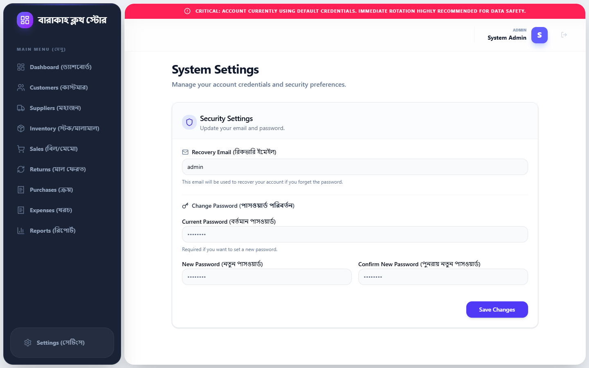

---

## 🔥 Deep Functionality & Generated Documents

### 🧾 Generating a Sale Memo (বিল তৈরি)
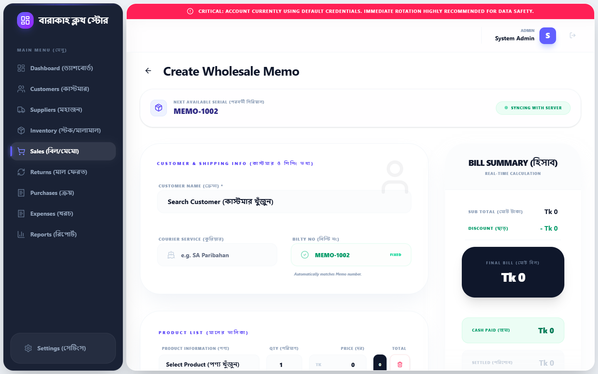

### 📄 Generated PDF Memo / Invoice
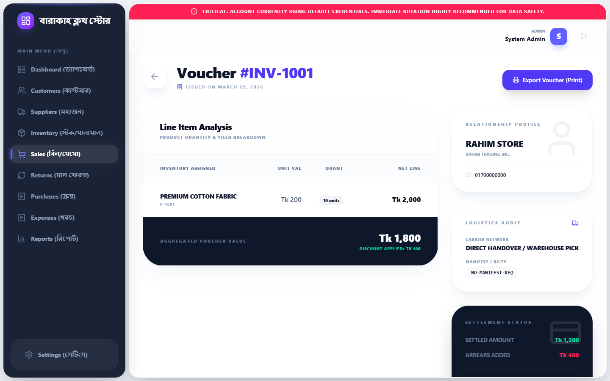

### 📙 Customer Ledger Details (কাস্টমারের হিসাব)
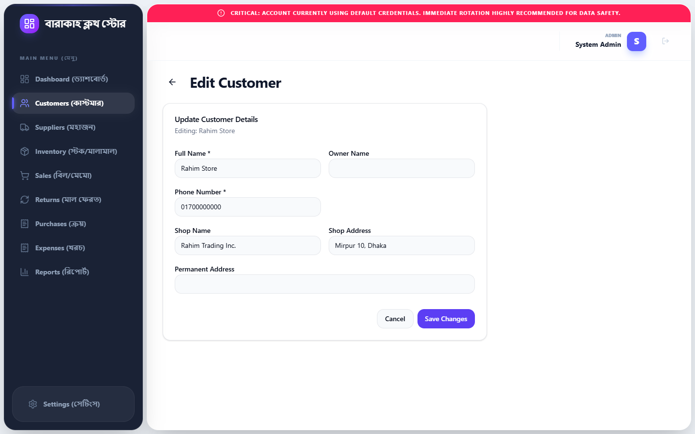

### 📥 New Purchase Entry (নতুন ক্রয়)
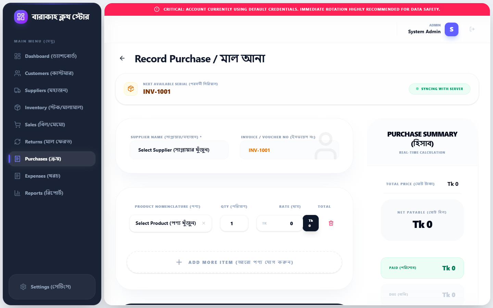

### 👤 Adding a New Customer
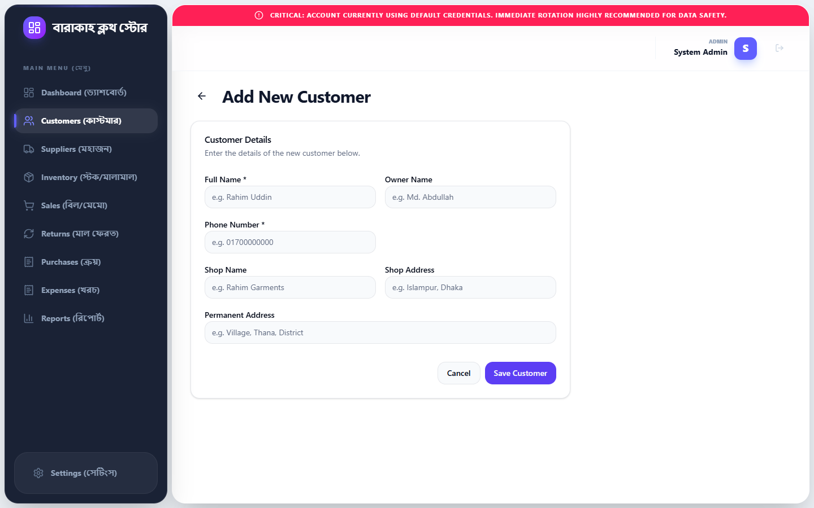

---

## 🚀 Getting Started Locally

This repo is structured as a portable bundle. You don't need continuous internet access.

To spin up the server:
1. Double-click `start-app.bat`
2. Wait a few seconds for the Node server to compile and start.
3. The app will open at `http://localhost:3000`

### 🔑 Login Credentials:
- **Username**: `admin`
- **Password**: `admin123`

## 🛠 Tech Stack
- **Framework**: Next.js 16 (App Router)
- **Database ORM**: Prisma
- **Styling**: TailwindCSS, Shadcn/UI
- **Icons**: Lucide React
